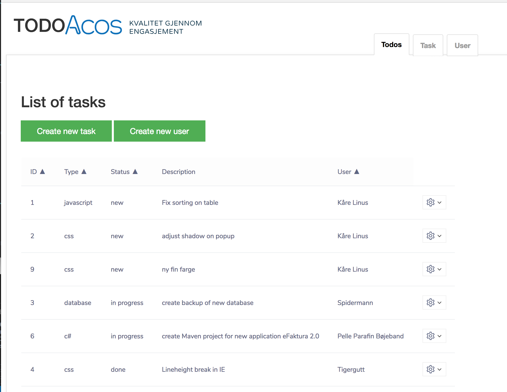

# Todos for ACOS


##Screendump


Screendump for Task overview page:





## Technology stack
 

* DB  ::  MySQL Distrib 5.7.22, for osx10.13 (x86_64)
* Backend :: C# ASP.NET Core Web API
	* NuGet
		* MySql Connector
		* Newtonsoft Json 	
* Frontend :: Vue 2.1.0
	* Vue componets 
		* vue-tabs-component
		* vue-data-tablee 
		* vue-loading-overlay
		* bp-vuejs-dropdown
		* vue-form-generator
	* Axios 
	* Bootstrap css	
	* webpack

## install
### Database
See [README](https://github.com/ab90467/todos/tree/developer/todos_db/README.md) under /todos_db	

###C# #
Use NuGet and add dependencies (Mysql and Newtonsoft Json)

### Frontend

Run 

```bash
todos_client/$npm install

```

## run locally

```bash

$mysql.server start

/todos/todos/$dotnet run

$npm run demo


```